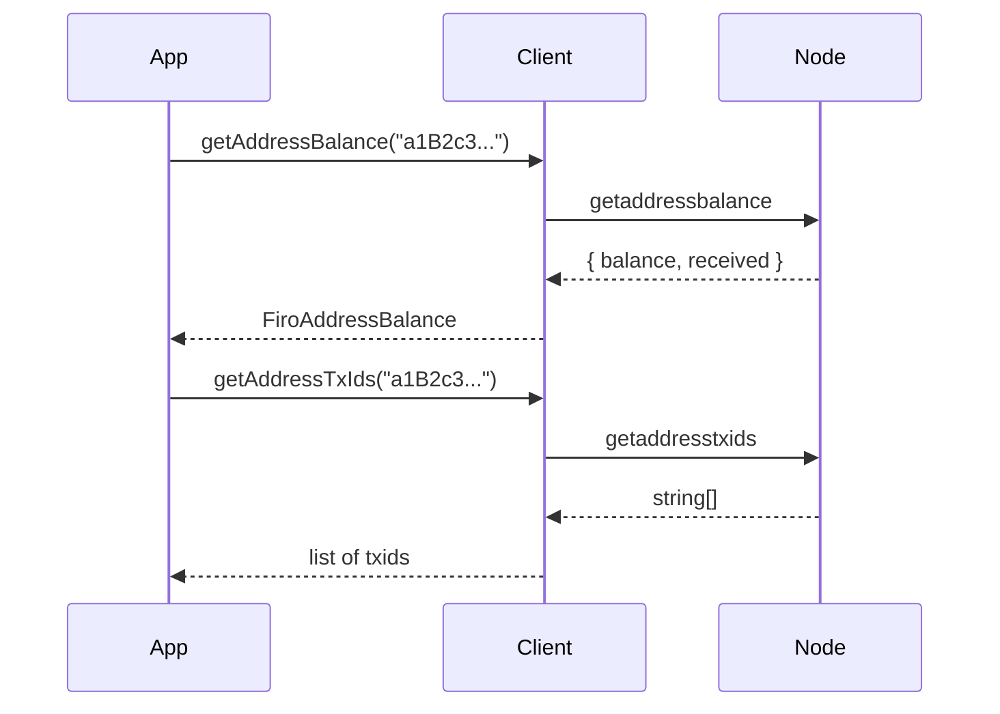

# Address Index

These methods let you query balance and transaction history for **any** Firo address — not just addresses in your wallet. This makes them ideal for building block explorers, monitoring payment addresses, or auditing third-party wallets.

> These methods require `addressindex=1` in your `firo.conf`. After adding this flag, restart your node with `-reindex` once to build the index.



## Methods

### `getAddressBalance(address)`

Returns the current balance and total received amount for any Firo address.

- `balance` — the amount currently held by the address (in satoshis)
- `received` — the total amount ever received (including already-spent funds)

```typescript
const info = await client.getAddressBalance("a1B2c3...");

console.log(`Balance:  ${info.balance} satoshis`);
console.log(`Received: ${info.received} satoshis`);
```

### `getAddressTxIds(address)`

Returns the list of transaction IDs associated with an address — every transaction that ever sent to or from it.

```typescript
const txids = await client.getAddressTxIds("a1B2c3...");

console.log(`${txids.length} transactions found`);
for (const txid of txids.slice(0, 5)) {
  console.log(txid);
}
```

## Example: Address Lookup

```typescript
const address = "a1B2c3...";

const [balance, txids] = await Promise.all([
  client.getAddressBalance(address),
  client.getAddressTxIds(address),
]);

console.log(`Address:      ${address}`);
console.log(`Balance:      ${balance.balance} satoshis`);
console.log(`Total in:     ${balance.received} satoshis`);
console.log(`Transactions: ${txids.length}`);
```
