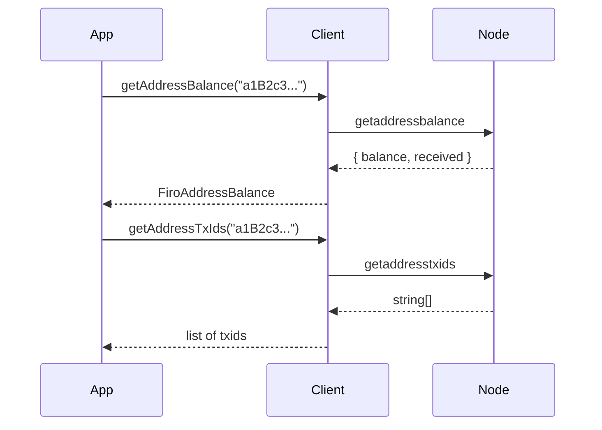

# Address Index

These methods let you query balance and transaction history for **any** Firo address — not just addresses in your wallet. This makes them ideal for building block explorers, monitoring payment addresses, or auditing third-party wallets.

> These methods require `addressindex=1` in your `firo.conf`. After adding this flag, restart your node with `-reindex` once to build the index.



## Methods

### `getAddressBalance(address)`

Returns the current balance and total received amount for any Firo address.

- `balance` — the amount currently held by the address (in satoshis)
- `received` — the total amount ever received (including already-spent funds)

```typescript
const info = await client.getAddressBalance('a1B2c3...');

console.log(`Balance:  ${info.balance} satoshis`);
console.log(`Received: ${info.received} satoshis`);
```

### `getAddressTxIds(address)`

Returns the list of transaction IDs associated with an address — every transaction that ever sent to or from it.

```typescript
const txids = await client.getAddressTxIds('a1B2c3...');

console.log(`${txids.length} transactions found`);
for (const txid of txids.slice(0, 5)) {
  console.log(txid);
}
```

### `getAddressDeltas(addresses, start?, end?)`

Returns every balance change (delta) for a set of addresses. Optionally filter by block height range with `start` and `end`. Each delta includes the satoshi amount (positive = received, negative = spent), txid, and block height.

```typescript
const deltas = await client.getAddressDeltas(['a1B2c3...']);

for (const d of deltas) {
  const direction = d.satoshis > 0 ? 'received' : 'spent';
  console.log(`Block ${d.height}: ${direction} ${Math.abs(d.satoshis)} sat (${d.txid})`);
}

// Only changes in a block range
const recent = await client.getAddressDeltas(['a1B2c3...'], 800000, 810000);
```

### `getAddressMempool(addresses)`

Returns unconfirmed (mempool) balance changes for a set of addresses — the same format as `getAddressDeltas` but for pending transactions only.

```typescript
const pending = await client.getAddressMempool(['a1B2c3...']);
console.log(`${pending.length} pending changes`);
```

### `getAddressUtxos(addresses)`

Returns all unspent outputs for a set of addresses — useful for building raw transactions without a wallet.

```typescript
const utxos = await client.getAddressUtxos(['a1B2c3...']);
const total = utxos.reduce((sum, u) => sum + u.satoshis, 0);
console.log(`${utxos.length} UTXOs, ${total} sat total`);
```

### `getSpentInfo(txid, index)`

Given a transaction output (`txid` + output `index`), returns the transaction that spent it. Useful for tracing coin flow forward through the chain.

```typescript
const spent = await client.getSpentInfo(txid, 0);
console.log(`Output was spent in: ${spent.txid} at index ${spent.index}`);
```

### `getTotalSupply()`

Returns the total FIRO supply currently in circulation.

```typescript
const supply = await client.getTotalSupply();
console.log(`Total supply: ${supply.total} FIRO`);
```

---

## Example: Address Lookup

```typescript
const address = 'a1B2c3...';

const [balance, txids] = await Promise.all([
  client.getAddressBalance(address),
  client.getAddressTxIds(address),
]);

console.log(`Address:      ${address}`);
console.log(`Balance:      ${balance.balance} satoshis`);
console.log(`Total in:     ${balance.received} satoshis`);
console.log(`Transactions: ${txids.length}`);
```