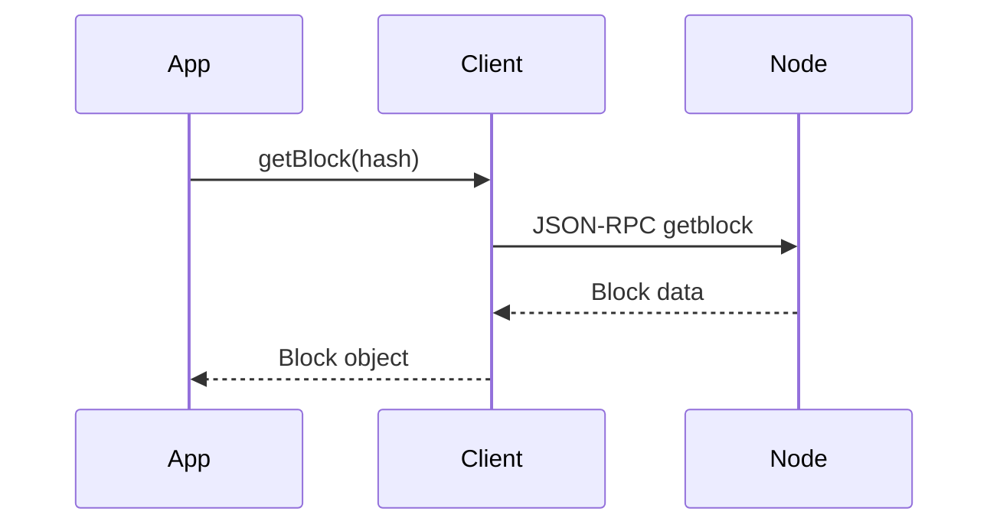

# Blockchain

These methods let you read the state of the Firo blockchain — the chain of blocks, individual transactions, and the unspent coin set. They're read-only and work without a wallet.

Use them when you want to:
- Check how far along the chain your node is
- Look up a block or transaction by its ID
- Verify that a transaction output hasn't been spent
- Get an overview of the entire chain's statistics



## Chain Overview

### `getBlockchainInfo()`

Returns a summary of the chain your node is on — the network name, block height, sync progress, and active protocol upgrades (soft forks).

```typescript
const info = await client.getBlockchainInfo();

console.log(info.chain);               // "main", "test", or "regtest"
console.log(info.blocks);              // current block height
console.log(info.verificationprogress); // 0.0–1.0 sync progress
```

### `getBlockCount()`

Returns the current block height — how many blocks are in the chain.

```typescript
const height = await client.getBlockCount();
console.log(`Node is at block ${height}`);
```

### `getBestBlockHash()`

Returns the hash of the most recent block at the tip of the chain.

```typescript
const hash = await client.getBestBlockHash();
```

### `getTxOutSetInfo()`

Returns statistics about all unspent transaction outputs (UTXOs) currently in the chain. Useful for auditing the total coin supply.

```typescript
const stats = await client.getTxOutSetInfo();

console.log(`Total FIRO in circulation: ${stats.total_amount}`);
console.log(`Unspent outputs: ${stats.txouts}`);
console.log(`At block: ${stats.height}`);
```

## Blocks

### `getBlockHash(height)`

Converts a block height (a number) into its hash (a hex string). You need the hash to fetch the full block.

```typescript
const hash = await client.getBlockHash(100000);
```

### `getBlock(hash)`

Fetches a full block including all its transactions.

```typescript
const block = await client.getBlock(hash);

console.log(`Block #${block.height}`);
console.log(`Transactions: ${block.tx.length}`);
console.log(`Mined at: ${new Date(block.time * 1000).toISOString()}`);
```

### `getBlockHeader(hash)`

Fetches the block header only — no transactions. Much lighter than `getBlock` when you only need metadata like timestamp or difficulty.

```typescript
const header = await client.getBlockHeader(hash);
// Pass false as second argument to get the raw hex instead
const hex = await client.getBlockHeader(hash, false);
```

## Transactions

### `getRawTransaction(txid)`

Fetches a transaction by its ID. Returns a fully decoded transaction object by default.

> Requires `txindex=1` in `firo.conf` for transactions outside your wallet or the mempool.

```typescript
const tx = await client.getRawTransaction(txid);

console.log(`Inputs:  ${tx.vin.length}`);
console.log(`Outputs: ${tx.vout.length}`);
console.log(`Confirmations: ${tx.confirmations}`);

// Pass false to get raw hex instead
const hex = await client.getRawTransaction(txid, false);
```

### `getTxOut(txid, n, includeMempool?)`

Checks whether a specific output of a transaction is still unspent. Returns `null` if the output has already been spent. Pass `includeMempool: false` to ignore unconfirmed spends (default: `true`).

```typescript
const output = await client.getTxOut(txid, 0);

if (output === null) {
  console.log('Output already spent');
} else {
  console.log(`Value: ${output.value} FIRO`);
}

// Ignore mempool — only confirmed spends count
const confirmed = await client.getTxOut(txid, 0, false);
```

## Mempool

The mempool is a waiting area for transactions that have been broadcast but not yet included in a block.

### `getMempoolInfo()`

Returns a summary of the mempool: how many transactions are waiting, how much memory they use, and the minimum fee rate required for acceptance.

```typescript
const info = await client.getMempoolInfo();

console.log(`Waiting transactions: ${info.size}`);
console.log(`Memory used: ${info.bytes} bytes`);
console.log(`Min fee rate: ${info.mempoolminfee}`);
```

### `getRawMempool()`

Returns all transactions currently in the mempool with their details.

```typescript
const mempool = await client.getRawMempool();

for (const [txid, entry] of Object.entries(mempool)) {
  console.log(`${txid}: fee ${entry.fee}, size ${entry.size}`);
}

// Pass false to get just a list of txids
const txids = await client.getRawMempool(false);
```

### `getMempoolEntry(txid)`

Fetches details for a single transaction in the mempool by its ID.

```typescript
const entry = await client.getMempoolEntry(txid);

console.log(`Fee: ${entry.fee}`);
console.log(`Time in mempool: ${entry.time}`);
```

### `getMempoolAncestors(txid, verbose?)`

Returns all unconfirmed ancestor transactions for a given mempool entry — the transactions it depends on. Pass `true` for full entry objects; omit or pass `false` for txid strings only.

```typescript
const ancestorIds = await client.getMempoolAncestors(txid);
const ancestorDetails = await client.getMempoolAncestors(txid, true);
```

### `getMempoolDescendants(txid, verbose?)`

Returns all unconfirmed descendant transactions for a given mempool entry — transactions that depend on it. Same verbose flag as `getMempoolAncestors`.

```typescript
const descendantIds = await client.getMempoolDescendants(txid);
const descendantDetails = await client.getMempoolDescendants(txid, true);
```

### `clearMempool()`

Removes all transactions from the mempool. Returns the list of txids that were cleared.

```typescript
const cleared = await client.clearMempool();
console.log(`Cleared ${cleared.length} transactions from mempool`);
```

## Chain State

### `getDifficulty()`

Returns the current proof-of-work difficulty as a multiple of the minimum difficulty.

```typescript
const difficulty = await client.getDifficulty();
console.log(`Current difficulty: ${difficulty}`);
```

### `getChainTips()`

Returns all known chain tips — the active chain tip plus any stale or invalid fork heads. Useful for detecting chain splits or orphaned blocks.

```typescript
const tips = await client.getChainTips();

for (const tip of tips) {
  console.log(`Height ${tip.height}: ${tip.hash} (${tip.status})`);
}
// status: "active" | "valid-fork" | "valid-headers" | "headers-only" | "invalid"
```

### `verifyChain(checklevel?, nblocks?)`

Verifies the integrity of the blockchain database. `checklevel` controls how thorough the check is (0–4, default 3); `nblocks` limits how many blocks back to check (default 6, 0 = all).

```typescript
const ok = await client.verifyChain();
console.log(`Chain valid: ${ok}`);
```

## Proofs

### `getTxOutProof(txids, blockhash?)`

Returns a serialized proof (hex) that the given txids were included in a block. Optionally restrict to a specific block.

```typescript
const proof = await client.getTxOutProof([txid]);
```

### `verifyTxOutProof(proof)`

Verifies a `getTxOutProof` proof and returns the txids it covers.

```typescript
const txids = await client.verifyTxOutProof(proof);
console.log(`Proof covers: ${txids.join(', ')}`);
```

## Advanced

### `getSpecialTxes(blockhash, type?, count?, skip?, verbosity?)`

Returns special transactions (e.g. masternode registrations) in a given block. Filter by `type` (`-1` for all), paginate with `count`/`skip`. Pass `verbosity: 2` to get full decoded transaction objects; `0` or `1` returns txid strings.

```typescript
// All special tx ids in a block
const txids = await client.getSpecialTxes(blockHash);

// Full decoded objects for type 1 (ProRegTx)
const txs = await client.getSpecialTxes(blockHash, 1, 10, 0, 2);
```

### `preciousBlock(blockhash)`

Treats a block as if it were received before others at the same height, influencing which chain tip is preferred. Returns `null` on success.

```typescript
await client.preciousBlock(blockHash);
```

### `pruneBlockchain(height)`

Prunes the blockchain up to (but not including) the given block height. Returns the height of the last block kept.

> Only available when the node is running in prune mode.

```typescript
const prunedTo = await client.pruneBlockchain(500000);
console.log(`Pruned up to block ${prunedTo}`);
```