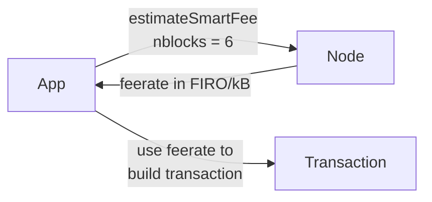

# Fees

These methods help you figure out how much to pay in transaction fees. Set the fee too low and your transaction may sit unconfirmed for a long time. Set it too high and you waste money.

Use them when you want to:

- Know the current network fee rate before sending
- Estimate what fee will get your transaction confirmed in N blocks
- Build fee-selection logic into a wallet or payment tool



## Methods

### `getFeeRate()`

Returns the current fee rate in satoshis per kilobyte. This is a simple, static snapshot of what the node considers a normal fee right now.

```typescript
const { rate } = await client.getFeeRate();
console.log(`Current rate: ${rate} sat/kB`);
```

### `estimateFee(nblocks)`

Estimates the fee rate (in FIRO per kilobyte) needed to get a transaction confirmed within `nblocks` blocks.

Returns `-1` if there's not enough data to estimate.

```typescript
const rate = await client.estimateFee(6);
if (rate === -1) {
  console.log("Not enough data to estimate");
} else {
  console.log(`Fee for ~6 block confirmation: ${rate} FIRO/kB`);
}
```

### `estimateSmartFee(nblocks)`

A smarter fee estimator that also returns how many blocks it actually expects confirmation to take. Prefers this over `estimateFee` when available.

```typescript
const estimate = await client.estimateSmartFee(6);
console.log(`Fee rate: ${estimate.feerate} FIRO/kB`);
console.log(`Expected within: ${estimate.blocks} blocks`);
```

### `estimatePriority(nblocks)`

Estimates the transaction priority needed to get confirmed within `nblocks` blocks without paying a fee (zero-fee transactions). Returns `-1` if there's insufficient data.

```typescript
const priority = await client.estimatePriority(6);
```

### `estimateSmartPriority(nblocks)`

Like `estimatePriority` but returns a smarter estimate along with how many blocks are actually expected.

```typescript
const estimate = await client.estimateSmartPriority(6);
console.log(`Priority: ${estimate.priority}`);
console.log(`Expected within: ${estimate.blocks} blocks`);
```

## Example: Picking a Fee

```typescript
// Aim for confirmation within 3 blocks
const { feerate, blocks } = await client.estimateSmartFee(3);

console.log(`To confirm within ~${blocks} blocks, use ${feerate} FIRO/kB`);
```
