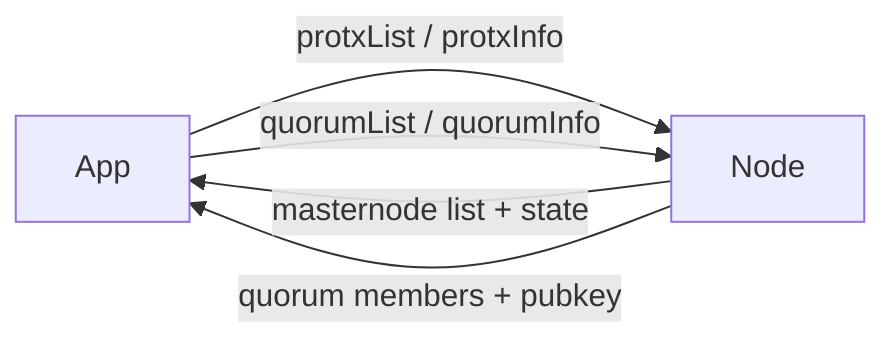

# Masternodes & Quorums

These methods expose Firo's evolution (evo) layer: masternode provider transactions (`protx`) and the LLMQ quorums masternodes form for chainlocks, InstantSend, and other threshold-signed operations.

Use them when you want to:
- List and inspect registered masternodes
- Track masternode list changes between two blocks
- Inspect quorum membership and DKG (distributed key generation) status
- Look up or verify recovered threshold signatures



:::caution Unconfirmed response shapes
`quorumGetRecSig`, `quorumHasRecSig`, and `quorumIsConflicting` have not been verified against a live node response — no valid `id`/`msgHash` pair was available for testing. `QuorumRecoveredSig` is typed as `unknown` until a real response is captured. Treat these three with extra care in production.
:::

## Methods

### `protxList()`

Returns the list of masternode provider transaction hashes currently known to the node.

```typescript
const proTxHashes = await client.protxList();
console.log(`${proTxHashes.length} masternodes registered`);
```

### `protxInfo(proTxHash)`

Returns detailed information about a single masternode: its collateral, operator/owner/voting/payout addresses, PoSe (proof-of-service) state, and which keys the local wallet holds for it.

```typescript
const info = await client.protxInfo(proTxHashes[0]);
console.log(info.state.service);       // masternode host:port
console.log(info.state.payoutAddress);
console.log(info.wallet.hasOwnerKey);  // does this wallet control it?
```

### `protxDiff(baseBlock, block)`

Returns the difference in the masternode list and quorum set between two block heights — useful for syncing masternode state incrementally instead of re-fetching the full list.

```typescript
const diff = await client.protxDiff(1000, 2000);
console.log(diff.mnList);        // masternodes added/changed
console.log(diff.deletedMNs);    // masternodes removed
console.log(diff.newQuorums);    // quorums formed in this range
```

### `quorumList()`

Returns all active quorum hashes, grouped by LLMQ type.

```typescript
const quorums = await client.quorumList();
for (const [llmqType, hashes] of Object.entries(quorums)) {
  console.log(`${llmqType}: ${hashes.length} quorums`);
}
```

### `quorumInfo(llmqType, quorumHash, includeSkShare?)`

Returns details about a specific quorum: its members, the mined block, and the quorum's aggregated public key. Pass `includeSkShare = true` to include this node's secret key share, if it has one.

```typescript
const info = await client.quorumInfo(1, quorumHash);
console.log(info.members.filter((m) => m.valid).length, 'valid members');
console.log(info.quorumPublicKey);
```

### `quorumDkgStatus()`

Returns the status of the current distributed key generation (DKG) session, plus any minable commitments the node knows about.

```typescript
const status = await client.quorumDkgStatus();
console.log(status.timeStr);
console.log(status.minableCommitments);
```

### `quorumMemberOf(proTxHash, scanQuorumsCount?)`

Returns the quorums a given masternode belongs to. `scanQuorumsCount` limits how many recent quorums (per LLMQ type) are scanned; omit it to use the node's default.

```typescript
const memberships = await client.quorumMemberOf(proTxHash);
for (const m of memberships) {
  console.log(`${m.type} @ height ${m.height}: valid=${m.isValidMember}`);
}
```

### `quorumGetRecSig(llmqType, id, msgHash)`

Fetches a recovered threshold signature for a given signing request, if one exists.

```typescript
const recSig = await client.quorumGetRecSig(1, requestId, msgHash);
```

### `quorumHasRecSig(llmqType, id, msgHash)`

Checks whether a recovered signature exists for a given signing request, without fetching the full signature.

```typescript
const exists = await client.quorumHasRecSig(1, requestId, msgHash);
```

### `quorumIsConflicting(llmqType, id, msgHash)`

Checks whether a conflicting signing request has already been signed for the given id.

```typescript
const conflicting = await client.quorumIsConflicting(1, requestId, msgHash);
```

## Evoznodes

### `evoznodeList()`

Returns the full list of registered evoznodes as a map of `proTxHash → EvozNodeInfo`.

```typescript
const nodes = await client.evoznodeList();
for (const [hash, node] of Object.entries(nodes)) {
  console.log(`${hash}: ${node.status} @ ${node.address}`);
}
```

### `evoznodeCount()`

Returns the count of total and enabled evoznodes on the network.

```typescript
const count = await client.evoznodeCount();
console.log(`Total: ${count.total}, Enabled: ${count.enabled}`);
```

### `evoznodeCurrent()`

Returns information about the evoznode that is due to be paid next.

```typescript
const current = await client.evoznodeCurrent();
console.log(`Next payee: ${current.payee} at height ${current.height}`);
```

### `evoznodeWinner()`

Returns information about the evoznode that won the most recent payment.

```typescript
const winner = await client.evoznodeWinner();
console.log(`Last winner: ${winner.payee}`);
```

### `evoznodeWinners()`

Returns a map of upcoming block heights to expected evoznode payee addresses.

```typescript
const winners = await client.evoznodeWinners();
for (const [height, payee] of Object.entries(winners)) {
  console.log(`Block ${height} → ${payee}`);
}
```

## BLS Keys

### `blsGenerate()`

Generates a new BLS key pair — a `secret` (private) key and a `public` key. Used when registering or updating a masternode operator key.

```typescript
const keypair = await client.blsGenerate();
console.log(`Public:  ${keypair.public}`);
console.log(`Private: ${keypair.secret}`);
```

### `blsFromSecret(secret)`

Derives the BLS public key from an existing BLS secret key.

```typescript
const keypair = await client.blsFromSecret(myBlsSecret);
console.log(`Derived public key: ${keypair.public}`);
```

## Network State

### `sporkList()`

Returns the current state of all active network sporks (feature flags controlled by the Firo team).

```typescript
const sporks = await client.sporkList();
console.log(sporks);
```

### `evoznsyncStatus()`

Returns the current evoznode sync status — whether the node has finished syncing the masternode list, quorums, and other evo-layer state.

```typescript
const status = await client.evoznsyncStatus();
console.log(`Synced: ${status.IsSynced}`);
console.log(`Asset: ${status.AssetName}`);
```

---

## Example: Auditing a Masternode

```typescript
const proTxHashes = await client.protxList();

for (const hash of proTxHashes) {
  const info = await client.protxInfo(hash);

  if (info.state.PoSeBanHeight !== -1) {
    console.log(`${hash} is PoSe-banned at height ${info.state.PoSeBanHeight}`);
    continue;
  }

  const memberships = await client.quorumMemberOf(hash);
  console.log(`${hash}: member of ${memberships.length} quorums`);
}
```
