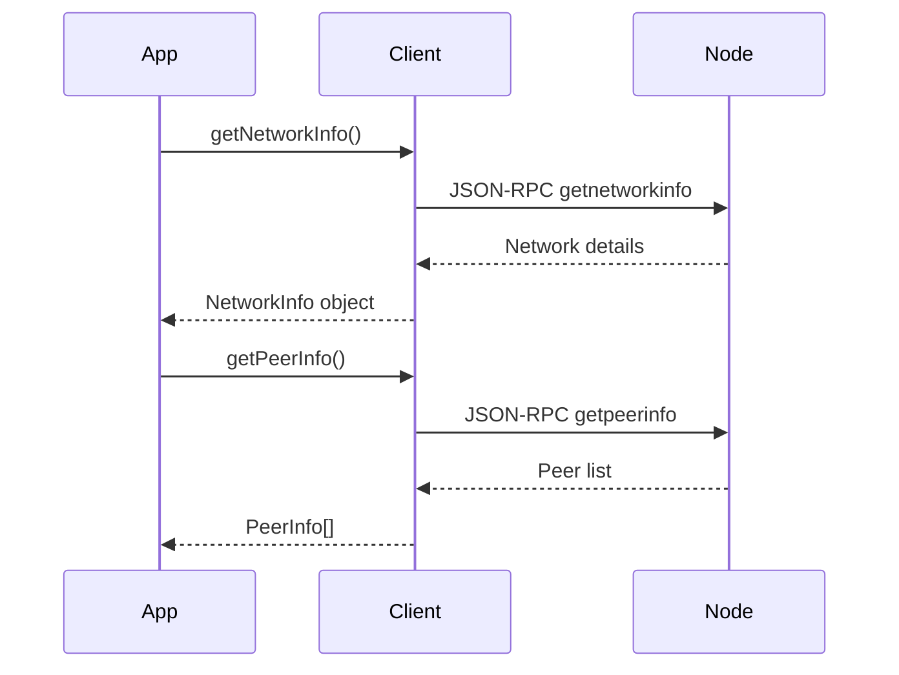

# Network

These methods give you visibility into your node's connectivity — what version it's running, which peers it's connected to, and whether it's actively relaying transactions.

Use them when you want to:
- Check if your node is online and connected
- Build a peer health dashboard
- Monitor your node's version and protocol status



## Methods

### `getNetworkInfo()`

Returns details about the node itself — its software version, protocol version, how many peers it's connected to, and the minimum fee it will relay.

```typescript
const info = await client.getNetworkInfo();

console.log(`Version: ${info.subversion}`);
console.log(`Connections: ${info.connections}`);
console.log(`Active: ${info.networkactive}`);
console.log(`Relay fee: ${info.relayfee} FIRO/kB`);
```

### `getPeerInfo()`

Returns a list of all nodes currently connected to yours. Each entry shows the peer's address, sync status, and data transfer stats.

```typescript
const peers = await client.getPeerInfo();

console.log(`Connected peers: ${peers.length}`);

for (const peer of peers) {
  const direction = peer.inbound ? 'inbound' : 'outbound';
  console.log(`${peer.addr} (${direction}) — ping ${peer.pingtime}ms`);
  console.log(`  Synced headers: ${peer.synced_headers}`);
  console.log(`  Synced blocks:  ${peer.synced_blocks}`);
}
```

## Example: Quick Health Check

```typescript
const [network, peers] = await Promise.all([
  client.getNetworkInfo(),
  client.getPeerInfo(),
]);

const healthy = network.networkactive && peers.length > 0;
console.log(healthy ? 'Node is healthy' : 'Node may be offline or isolated');
```