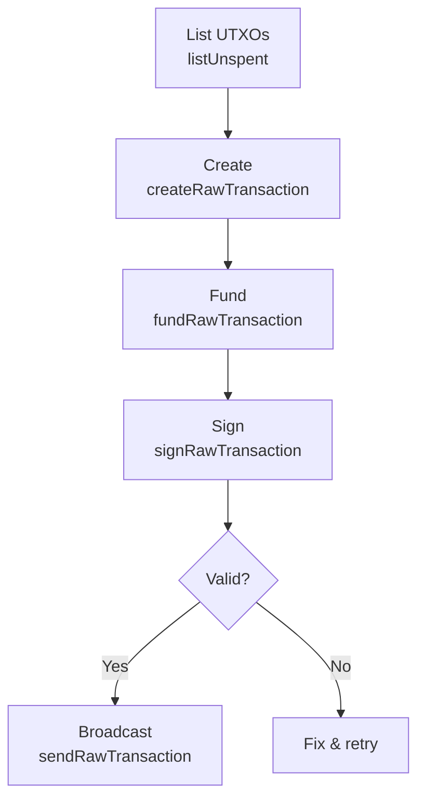

# Raw Transactions

Raw transaction methods give you direct control over how transactions are constructed and signed. Instead of using the wallet to do everything automatically, you build the transaction step by step.

Use them when you want to:

- Construct a transaction manually with specific inputs and outputs
- Sign a transaction with external keys (e.g. hardware wallet)
- Inspect a raw transaction you received from somewhere else
- Build multi-step transaction workflows



## Lifecycle

A raw transaction follows this sequence:

1. **Create** — specify which inputs to spend and where the money goes
2. **Fund** — let the node add inputs and a change output to cover the amount
3. **Sign** — authorize the transaction with your private keys
4. **Broadcast** — submit it to the network

---

## Methods

### `createRawTransaction(inputs, outputs, locktime?)`

Creates an unsigned transaction from a list of inputs (UTXOs to spend) and outputs (addresses and amounts to send to).

```typescript
const hex = await client.createRawTransaction(
  [{ txid: "abc123...", vout: 0 }], // inputs: UTXOs to spend
  { "aRecipientAddress...": 1.0 }, // outputs: address → amount
);
```

### `fundRawTransaction(hex, options?)`

Takes an incomplete transaction and adds inputs from your wallet to cover the total output amount, plus a change output for the remainder. Returns the updated transaction hex, the fee, and the position of the change output.

```typescript
const { hex: fundedHex, fee, changepos } = await client.fundRawTransaction(hex);
console.log(`Fee: ${fee} FIRO, change at output index ${changepos}`);
```

### `signRawTransaction(hex, prevtxs?, privatekeys?, sighashtype?)`

Signs a raw transaction. By default it uses keys from your wallet. You can also provide external private keys or previous transaction details for scripts that need them.

```typescript
const { hex: signedHex, complete } = await client.signRawTransaction(fundedHex);

if (!complete) {
  console.log("Transaction needs more signatures");
}
```

### `sendRawTransaction(hex, allowHighFees?)`

Broadcasts a fully signed transaction to the network. Returns the transaction ID if accepted.

```typescript
const txid = await client.sendRawTransaction(signedHex);
console.log(`Broadcast! txid: ${txid}`);
```

### `decodeRawTransaction(hex)`

Parses a raw transaction hex and returns a human-readable breakdown of its inputs and outputs. Useful for inspecting transactions before sending.

```typescript
const decoded = await client.decodeRawTransaction(hex);

console.log(`Inputs:  ${decoded.vin.length}`);
console.log(`Outputs: ${decoded.vout.length}`);
for (const out of decoded.vout) {
  console.log(
    `  ${out.value} FIRO → ${out.scriptPubKey.addresses?.join(", ")}`,
  );
}
```

### `decodeScript(hex)`

Parses a script (the locking/unlocking conditions on a transaction output) and returns its assembly representation and type.

```typescript
const script = await client.decodeScript(scriptHex);
console.log(`Type: ${script.type}`);
console.log(`ASM:  ${script.asm}`);
```

---

## Example: Full Lifecycle

```typescript
// 1. Pick a UTXO to spend
const utxos = await client.listUnspent();
const input = utxos[0];

// 2. Create unsigned transaction
const rawHex = await client.createRawTransaction(
  [{ txid: input.txid, vout: input.vout }],
  { "aRecipientAddress...": 0.5 },
);

// 3. Fund (adds change output)
const { hex: fundedHex } = await client.fundRawTransaction(rawHex);

// 4. Inspect before signing
const decoded = await client.decodeRawTransaction(fundedHex);
console.log("About to sign:", decoded);

// 5. Sign
const { hex: signedHex, complete } = await client.signRawTransaction(fundedHex);
if (!complete) throw new Error("Signing incomplete");

// 6. Broadcast
const txid = await client.sendRawTransaction(signedHex);
console.log(`Done! txid: ${txid}`);
```
