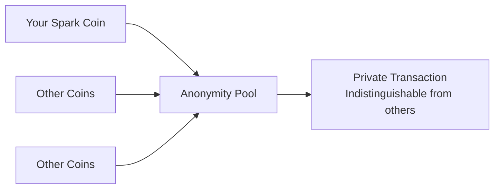
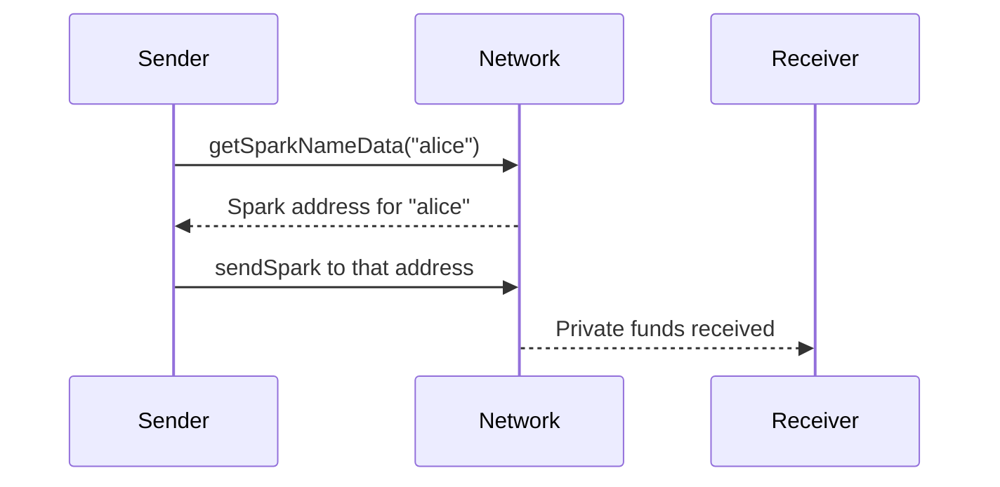
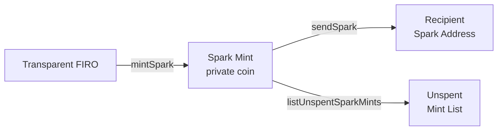

# Spark (Privacy)

Spark is Firo's built-in privacy protocol. It lets you convert regular (transparent) FIRO into private coins whose sender, receiver, and amount are hidden from outside observers.

This section covers four groups of Spark methods:
- **Anonymity Set** — the pool of private coins used to hide your transactions
- **Names** — human-readable names that map to Spark addresses
- **Balances & Addresses** — managing your private funds and addresses
- **Mints & Spends** — the lifecycle of private coins

> All Spark methods require `mobile=1` in your `firo.conf`.

---

## Anonymity Set

The anonymity set is the pool of all existing Spark coins on the network. When you spend a private coin, your transaction is mixed with others from this set, making it impossible to tell which coin was actually spent.



### `getSparkLatestCoinId()`

Returns the ID of the current coin group (sector). Coin groups are created periodically as more Spark coins accumulate.

```typescript
const latestId = await client.getSparkLatestCoinId();
```

### `getSparkAnonymitySet(coinGroupId, startBlockHash)`

Returns all Spark coins in a given group starting from a specific block. Used by light wallets to sync the anonymity set without downloading the full blockchain.

```typescript
const set = await client.getSparkAnonymitySet(1, startHash);
console.log(`Coins in set: ${set.coins.length}`);
```

### `getSparkAnonymitySetMeta(coinGroupId)`

Returns lightweight metadata about a coin group — its hash and size — without downloading the full coin list.

```typescript
const meta = await client.getSparkAnonymitySetMeta(latestId);
console.log(`Set size: ${meta.size}`);
```

### `getSparkAnonymitySetSector(coinGroupId, latestBlock, startIndex, endIndex)`

Returns a slice of the anonymity set for a given index range. Useful for paginated syncing in bandwidth-constrained environments.

```typescript
const sector = await client.getSparkAnonymitySetSector(1, blockHash, 0, 100);
console.log(`Sector coins: ${sector.coins.length}`);
```

### `getMempoolSparkTxIds()`

Returns the IDs of Spark transactions currently waiting in the mempool (not yet confirmed).

```typescript
const sparkTxids = await client.getMempoolSparkTxIds();
```

### `getMempoolSparkTxs(txids)`

Returns full details for a list of Spark transactions in the mempool.

```typescript
const txs = await client.getMempoolSparkTxs(sparkTxids);
```

---

## Spark Names

Spark Names are human-readable identifiers (like `alice.spark`) that map to a Spark address. Instead of sharing a long cryptographic address, you can share a simple name.



### `getSparkNames(fOnlyOwn?)`

Lists Spark names. Pass `true` to see only names registered to your wallet.

```typescript
const allNames = await client.getSparkNames();
const myNames = await client.getSparkNames(true);

for (const n of myNames) {
  console.log(`${n.name} → ${n.address} (valid until block ${n.validUntil})`);
}
```

### `getSparkNameData(sparkname)`

Looks up the Spark address and registration details for a given name.

```typescript
const data = await client.getSparkNameData('alice');
console.log(`Address: ${data.address}`);
console.log(`Valid until block: ${data.validUntil}`);
```

### `registerSparkName(name, sparkAddress, years, additionalData?)`

Registers a new Spark name pointing to one of your Spark addresses. Returns the transaction ID of the registration.

```typescript
const txid = await client.registerSparkName('alice', mySparkAddress, 2);
console.log(`Registered! txid: ${txid}`);
```

### `requestSparkNameTransfer(name, newSparkAddress, years, oldSparkAddress, additionalData?)`

Initiates a transfer of a Spark name from one address to another. The original owner must approve the transfer using `transferSparkName`.

```typescript
const requestHash = await client.requestSparkNameTransfer(
  'alice',
  newAddress,
  2,
  oldAddress,
);
```

### `transferSparkName(oldSparkAddress, requestHash)`

Completes a name transfer that was previously requested. Must be called by the current owner.

```typescript
const txid = await client.transferSparkName(oldAddress, requestHash);
```

### `getSparkNameTxDetails(txid)`

Returns the Spark name registration details for a given registration transaction.

> Only available via direct node RPC — not supported on ElectrumX.

```typescript
const details = await client.getSparkNameTxDetails(registrationTxid);
```

---

## Balances & Addresses

### `getSparkBalance()`

Returns your wallet's total Spark (private) balance, broken down into available, unconfirmed, and full amounts.

```typescript
const balance = await client.getSparkBalance();

console.log(`Available:    ${balance.availableBalance} FIRO`);
console.log(`Unconfirmed:  ${balance.unconfirmedBalance} FIRO`);
console.log(`Full:         ${balance.fullBalance} FIRO`);
```

### `getSparkAddressBalance(address)`

Returns the balance for a specific Spark address.

```typescript
const balance = await client.getSparkAddressBalance(mySparkAddress);
```

### `getTotalBalance()`

Returns your combined transparent + Spark balance as a single number.

```typescript
const total = await client.getTotalBalance();
```

### `getPrivateBalance()`

Returns only the Spark (private) portion of your balance.

```typescript
const private_ = await client.getPrivateBalance();
```

### `getNewSparkAddress()`

Generates a new Spark address from your wallet. Spark addresses are longer and start with a different prefix than regular Firo addresses.

```typescript
const [address] = await client.getNewSparkAddress();
```

### `getSparkDefaultAddress()`

Returns your wallet's default Spark address.

```typescript
const [defaultAddr] = await client.getSparkDefaultAddress();
```

### `getAllSparkAddresses()`

Returns all Spark addresses your wallet has generated, keyed by their diversifier index.

```typescript
const addresses = await client.getAllSparkAddresses();
console.log(`Total Spark addresses: ${Object.keys(addresses).length}`);
```

### `dumpSparkViewKey()`

Exports your Spark view key — a special key that allows read-only access to your Spark transaction history without the ability to spend.

:::caution
Keep this key private. Anyone with it can see your Spark transaction history.
:::

```typescript
const viewKey = await client.dumpSparkViewKey();
```

---

## Mints & Spends

"Minting" converts transparent FIRO into private Spark coins. "Spending" converts them back or sends them to another Spark address.



### `mintSpark(recipients, subtractFeeFromAmount?)`

Converts transparent FIRO into private Spark coins for one or more Spark addresses.

```typescript
const txids = await client.mintSpark({
  [mySparkAddress]: { amount: 10, memo: 'savings' },
});
console.log(`Minted in: ${txids}`);
```

### `autoMintSpark()`

Automatically mints all available transparent funds into Spark. The node picks the optimal amounts.

```typescript
const txids = await client.autoMintSpark();
```

### `sendSpark(recipients)`

Sends private Spark coins to one or more Spark addresses. This is a fully private send — the amounts and addresses are not visible on-chain.

```typescript
const txid = await client.sendSpark({
  [recipientSparkAddress]: { amount: 1.5, subtractFee: false },
});
console.log(`Sent! txid: ${txid}`);
```

:::caution
`sendSpark` returns a transaction ID as soon as the transaction is built — this does **not** mean it was successfully broadcast. Verify with `getTransaction(txid)` and check that `confirmations > 0` and `trusted` before treating the send as final.
:::

### `listSparkMints()`

Lists all Spark mints your wallet knows about, including spent ones.

```typescript
const mints = await client.listSparkMints();

for (const mint of mints) {
  const status = mint.isUsed ? 'spent' : 'unspent';
  console.log(`${mint.txid}: ${mint.amount} FIRO (${status})`);
}
```

### `listUnspentSparkMints()`

Lists only the Spark coins that haven't been spent yet — your spendable private balance.

```typescript
const unspent = await client.listUnspentSparkMints();
const total = unspent.reduce((sum, m) => sum + m.amount, 0);
console.log(`Spendable Spark: ${total} FIRO across ${unspent.length} coins`);
```

### `listSparkSpends()`

Lists all Spark coins your wallet has spent.

```typescript
const spends = await client.listSparkSpends();
```

### `identifySparkCoins(txid)`

Given a transaction ID, identifies which Spark coins in it belong to your wallet and updates your balance accordingly.

```typescript
const result = await client.identifySparkCoins(txid);
console.log(`New available balance: ${result.availableBalance}`);
```

### `getSparkCoinAddr(txid)`

Returns the Spark address, memo, and amount for each Spark output in a transaction that belongs to your wallet.

```typescript
const coins = await client.getSparkCoinAddr(txid);
for (const coin of coins) {
  console.log(`Address: ${coin.address}, Amount: ${coin.amount}, Memo: ${coin.memo}`);
}
```

### `getUsedCoinsTags(startIndex)`

Returns a list of "tags" for spent Spark coins starting from a given index. Used by light wallets to detect which coins have been spent without revealing which ones.

```typescript
const { tags } = await client.getUsedCoinsTags(0);
console.log(`Known spent coin tags: ${tags.length}`);
```

### `setSparkMintStatus(lTagHash, isUsed)`

Manually marks a Spark coin as used or unused in your local wallet database. Use this if your wallet's state gets out of sync.

```typescript
await client.setSparkMintStatus(lTagHash, true);
```

### `resetSparkMints()`

Resets all Spark mint data in your wallet and rescans. Use this to recover from sync issues.

:::caution
This erases your local Spark state and re-syncs from the chain. It may take time.
:::

```typescript
await client.resetSparkMints();
```

### `getSparkMintMetadata(coinHashes)`

Returns metadata for specific Spark coins identified by their coin hashes (from the anonymity set).

```typescript
const metadata = await client.getSparkMintMetadata([hash1, hash2]);
```