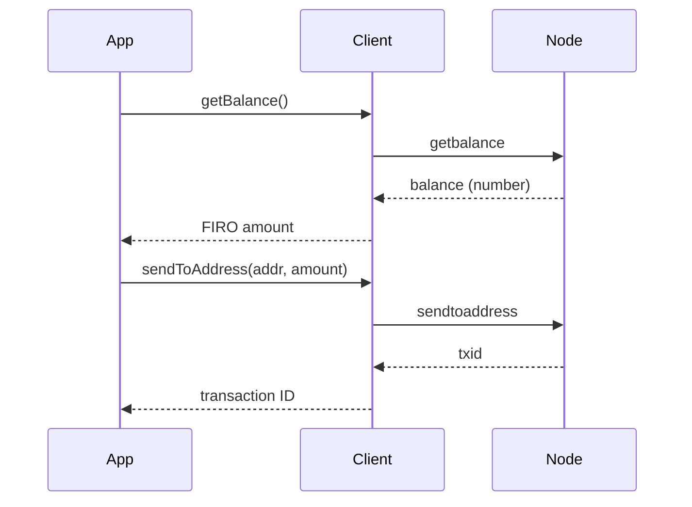

# Wallet

These methods interact with the wallet built into your Firo node. They let you check balances, look up transactions, generate addresses, and send FIRO to other addresses.

Use them when you want to:
- Check how much FIRO is in your node's wallet
- List past transactions
- Generate a new address for receiving funds
- Send FIRO to someone else
- Watch an external address without controlling its private key



## Balances

### `getWalletInfo()`

Returns a summary of your wallet's state: balance, number of transactions, key pool size, and whether the wallet is locked.

```typescript
const info = await client.getWalletInfo();

console.log(`Balance: ${info.balance} FIRO`);
console.log(`Unconfirmed: ${info.unconfirmed_balance} FIRO`);
console.log(`Tx count: ${info.txcount}`);
```

### `getBalance(minconf?)`

Returns your wallet's confirmed balance. The optional `minconf` parameter sets the minimum number of confirmations required (default: 1).

```typescript
const balance = await client.getBalance();
// Only count funds with 6+ confirmations
const safeBalance = await client.getBalance(6);
```

### `getUnconfirmedBalance()`

Returns the total value of incoming transactions that haven't been confirmed in a block yet.

```typescript
const pending = await client.getUnconfirmedBalance();
console.log(`Pending: ${pending} FIRO`);
```

### `getReceivedByAddress(address, minconf?)`

Returns the total amount received by a specific address, counting only transactions with at least `minconf` confirmations.

```typescript
const received = await client.getReceivedByAddress('a1B2c3...', 1);
```

## Addresses

### `getNewAddress(label?)`

Generates a new Firo address from your wallet. You can optionally attach a label to help you remember what it's for.

```typescript
const address = await client.getNewAddress();
const labeledAddress = await client.getNewAddress('donations');
```

### `validateAddress(address)`

Checks whether an address is valid and, if it belongs to your wallet, returns extra details about it.

```typescript
const result = await client.validateAddress('a1B2c3...');

if (!result.isvalid) {
  console.log('Invalid address!');
} else {
  console.log(`Belongs to my wallet: ${result.ismine}`);
}
```

### `importAddress(address, label?, rescan?, p2sh?)`

Adds an external address to your wallet as a watch-only address. Your node will track its balance and transactions but cannot spend from it.

> Note: setting `rescan: true` (the default) causes the node to re-scan the entire blockchain, which can take a long time.

```typescript
await client.importAddress('a1B2c3...', 'partner-wallet', false);
```

## Transactions

### `getTransaction(txid)`

Fetches a transaction from your wallet's history. This works even without `txindex` because it only looks in your wallet.

```typescript
const tx = await client.getTransaction(txid);

console.log(`Amount: ${tx.amount} FIRO`);
console.log(`Confirmations: ${tx.confirmations}`);
console.log(`Fee: ${tx.fee} FIRO`);
```

### `listTransactions(label?, count?, skip?)`

Lists recent wallet transactions. You can filter by label, limit how many results come back, and skip past older ones for pagination.

```typescript
// Last 10 transactions
const txs = await client.listTransactions();

// Page 2: skip the first 10, get the next 10
const page2 = await client.listTransactions('*', 10, 10);

for (const tx of txs) {
  console.log(`${tx.category}: ${tx.amount} FIRO (${tx.confirmations} confs)`);
}
```

### `listSinceBlock(blockhash?, targetConfirmations?, includeWatchOnly?)`

Returns all wallet transactions that occurred after a specific block. Useful for polling — store the `lastblock` from each response and pass it back next time to get only new transactions.

```typescript
// All transactions since genesis
const result = await client.listSinceBlock();

// All transactions since a known block
const result2 = await client.listSinceBlock(lastKnownBlockHash);

console.log(`New transactions: ${result2.transactions.length}`);
console.log(`Next checkpoint: ${result2.lastblock}`);
```

### `listUnspent(minconf?, maxconf?, addresses?, includeUnsafe?)`

Lists unspent transaction outputs (UTXOs) in your wallet. These are the "coins" you can spend.

```typescript
const utxos = await client.listUnspent();
const total = utxos.reduce((sum, u) => sum + u.amount, 0);

console.log(`${utxos.length} UTXOs totaling ${total} FIRO`);
```

### `getRawChangeAddress()`

Generates a new change address from your wallet. Typically used when constructing raw transactions manually.

```typescript
const changeAddr = await client.getRawChangeAddress();
```

### `listAddressBalances(minAmount?)`

Returns a map of `address → balance` for all wallet addresses with a balance above `minAmount` (default 0).

```typescript
const balances = await client.listAddressBalances();
for (const [address, balance] of Object.entries(balances)) {
  console.log(`${address}: ${balance} FIRO`);
}
```

### `listAddressGroupings()`

Returns groups of addresses that share a common wallet history — addresses that have been inputs in the same transaction are grouped together. Each entry is `[address, balance, label?]`.

```typescript
const groupings = await client.listAddressGroupings();
for (const group of groupings) {
  for (const [address, balance] of group) {
    console.log(`${address}: ${balance} FIRO`);
  }
}
```

### `listReceivedByAddress(minconf?, includeEmpty?, includeWatchOnly?)`

Lists all addresses that have received funds, with their totals and associated txids.

```typescript
const entries = await client.listReceivedByAddress(1, false);
for (const entry of entries) {
  console.log(`${entry.address}: ${entry.amount} FIRO (${entry.txids?.length} txs)`);
}
```

### `listLockUnspent()`

Returns the list of temporarily locked (unspendable) UTXOs in your wallet.

```typescript
const locked = await client.listLockUnspent();
for (const utxo of locked) {
  console.log(`Locked: ${utxo.txid}:${utxo.vout}`);
}
```

### `lockUnspent(unlock, transactions?)`

Locks or unlocks specific UTXOs to prevent them from being spent automatically. Pass `unlock: false` to lock, `true` to unlock.

```typescript
// Lock a UTXO
await client.lockUnspent(false, [{ txid, vout: 0 }]);

// Unlock all locked UTXOs
await client.lockUnspent(true);
```

## Keys & Signing

### `signMessage(address, message)`

Signs a message with the private key of a wallet address. Returns a base64-encoded signature.

```typescript
const signature = await client.signMessage('a1B2c3...', 'hello world');
```

### `signMessageWithSparkAddress(sparkAddress, message)`

Signs a message using the key associated with a Spark address in your wallet.

```typescript
const signature = await client.signMessageWithSparkAddress(mySparkAddress, 'hello');
```

### `dumpPrivKey(address, code?)`

Exports the private key for a wallet address.

:::caution
`dumpprivkey` requires a two-step confirmation unique to Firo's daemon. The first call (address only) always errors and returns a one-time confirmation code in the error message. Pass that code as the second argument to complete the export.

```typescript
// Step 1 — will throw; extract the code from error.message
try {
  await client.dumpPrivKey('a1B2c3...');
} catch (e) {
  const code = extractCodeFromError(e);
  // Step 2 — returns the WIF private key
  const wif = await client.dumpPrivKey('a1B2c3...', code);
}
```
:::

### `importPrivKey(privKey, label?, rescan?)`

Imports a WIF private key into the wallet. Set `rescan: false` to skip the blockchain rescan (faster but balance won't update until the next rescan).

```typescript
await client.importPrivKey(wifKey, 'imported', false);
```

### `importPubKey(pubKey, label?, rescan?)`

Imports a public key as a watch-only entry. The wallet tracks transactions for the derived address without being able to spend.

```typescript
await client.importPubKey(hexPubKey, 'watch-only', false);
```

### `importMulti(requests, options?)`

Batch-imports a list of scripts, addresses, or keys with flexible options. Set `options.rescan: false` to skip the rescan.

```typescript
const results = await client.importMulti(
  [{ scriptPubKey: { address: 'a1B2c3...' }, timestamp: 'now', watchonly: true }],
  { rescan: false },
);
```

## Sending

### `sendToAddress(address, amount, comment?, commentTo?, subtractFeeFromAmount?)`

Sends FIRO to a Firo address. Returns the transaction ID of the broadcast transaction.

```typescript
const txid = await client.sendToAddress('a1B2c3...', 1.5);
console.log(`Sent! txid: ${txid}`);

// Subtract the fee from the amount being sent (recipient pays fee)
const txid2 = await client.sendToAddress('a1B2c3...', 1.5, '', '', true);
```

:::caution
This immediately broadcasts the transaction to the network. Always double-check the address before calling.
:::

### `sendTransparent(address, amount, comment?, commentTo?, subtractFeeFromAmount?)`

Sends transparent FIRO — functionally identical to `sendToAddress` but uses the `sendtransparent` RPC, which is the preferred method going forward.

```typescript
const txid = await client.sendTransparent('a1B2c3...', 1.5);
```

### `sendTransparentMany(recipients)`

Sends transparent FIRO to multiple recipients in a single transaction. Each key is an address; the value specifies the `amount` and optional `subtractFee`/`memo`.

```typescript
const txid = await client.sendTransparentMany({
  ['a1B2c3...']: { amount: 1.0 },
  ['b4D5e6...']: { amount: 0.5, subtractFee: true },
});
```

### `sendMany(recipients, minconf?, comment?, subtractFeeFrom?)`

Sends to multiple transparent addresses in one transaction. `recipients` is a `Record<address, amount>` map.

```typescript
const txid = await client.sendMany({
  'a1B2c3...': 1.0,
  'b4D5e6...': 0.5,
});
```

### `sendSparkMany(recipients, comment?, subtractFeeFrom?)`

Sends Spark (private) FIRO to multiple addresses in one transaction. `recipients` is a `Record<sparkAddress, amount>` map.

```typescript
const txid = await client.sendSparkMany({
  [sparkAddress1]: 1.0,
  [sparkAddress2]: 0.5,
});
```

### `spendSpark(recipients)`

Spends from private Spark coins to one or more Spark recipients. Uses the `spendspark` RPC (distinct from `sendspark`).

```typescript
const txid = await client.spendSpark({
  [recipientSparkAddress]: { amount: 1.0, subtractFee: false },
});
```

### `bumpFee(txid, options?)`

Bumps the fee on an unconfirmed, opt-in RBF transaction. Returns the new txid and fee information.

```typescript
const result = await client.bumpFee(originalTxid, { confTarget: 2 });
console.log(`New txid: ${result.txid}`);
console.log(`Old fee: ${result.origfee}, new fee: ${result.fee}`);
```

### `abandonTransaction(txid)`

Marks an unconfirmed transaction as abandoned, removing it from your wallet's pending list. Only works if the transaction has not been broadcast or is no longer in the mempool.

```typescript
await client.abandonTransaction(txid);
```

## Fee Configuration

### `setTxFee(amount)`

Sets the default transaction fee rate (in FIRO per kB) used when no explicit fee is given. Returns `true` on success.

```typescript
const ok = await client.setTxFee(0.0001);
```

### `setMinInput(amount)`

Sets the minimum input amount that the wallet will use when building transactions. Returns `true` on success.

```typescript
const ok = await client.setMinInput(0.001);
```