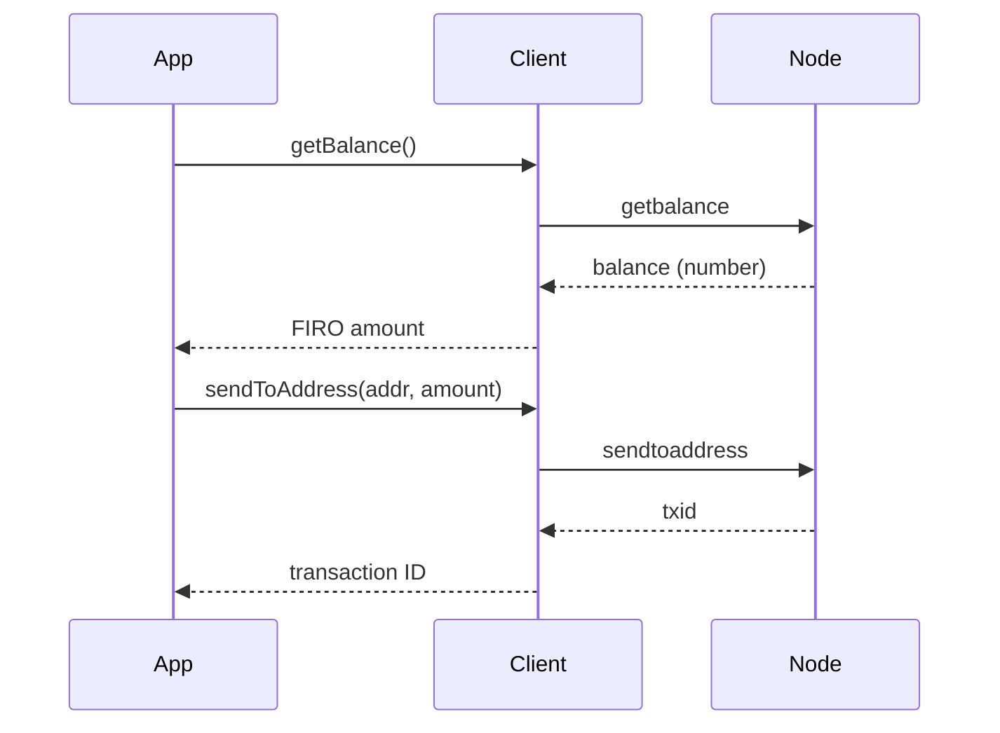

# Wallet

These methods interact with the wallet built into your Firo node. They let you check balances, look up transactions, generate addresses, and send FIRO to other addresses.

Use them when you want to:

- Check how much FIRO is in your node's wallet
- List past transactions
- Generate a new address for receiving funds
- Send FIRO to someone else
- Watch an external address without controlling its private key



## Balances

### `getWalletInfo()`

Returns a summary of your wallet's state: balance, number of transactions, key pool size, and whether the wallet is locked.

```typescript
const info = await client.getWalletInfo();

console.log(`Balance: ${info.balance} FIRO`);
console.log(`Unconfirmed: ${info.unconfirmed_balance} FIRO`);
console.log(`Tx count: ${info.txcount}`);
```

### `getBalance(minconf?)`

Returns your wallet's confirmed balance. The optional `minconf` parameter sets the minimum number of confirmations required (default: 1).

```typescript
const balance = await client.getBalance();
// Only count funds with 6+ confirmations
const safeBalance = await client.getBalance(6);
```

### `getUnconfirmedBalance()`

Returns the total value of incoming transactions that haven't been confirmed in a block yet.

```typescript
const pending = await client.getUnconfirmedBalance();
console.log(`Pending: ${pending} FIRO`);
```

### `getReceivedByAddress(address, minconf?)`

Returns the total amount received by a specific address, counting only transactions with at least `minconf` confirmations.

```typescript
const received = await client.getReceivedByAddress("a1B2c3...", 1);
```

## Addresses

### `getNewAddress(label?)`

Generates a new Firo address from your wallet. You can optionally attach a label to help you remember what it's for.

```typescript
const address = await client.getNewAddress();
const labeledAddress = await client.getNewAddress("donations");
```

### `validateAddress(address)`

Checks whether an address is valid and, if it belongs to your wallet, returns extra details about it.

```typescript
const result = await client.validateAddress("a1B2c3...");

if (!result.isvalid) {
  console.log("Invalid address!");
} else {
  console.log(`Belongs to my wallet: ${result.ismine}`);
}
```

### `importAddress(address, label?, rescan?, p2sh?)`

Adds an external address to your wallet as a watch-only address. Your node will track its balance and transactions but cannot spend from it.

> Note: setting `rescan: true` (the default) causes the node to re-scan the entire blockchain, which can take a long time.

```typescript
await client.importAddress("a1B2c3...", "partner-wallet", false);
```

## Transactions

### `getTransaction(txid)`

Fetches a transaction from your wallet's history. This works even without `txindex` because it only looks in your wallet.

```typescript
const tx = await client.getTransaction(txid);

console.log(`Amount: ${tx.amount} FIRO`);
console.log(`Confirmations: ${tx.confirmations}`);
console.log(`Fee: ${tx.fee} FIRO`);
```

### `listTransactions(label?, count?, skip?)`

Lists recent wallet transactions. You can filter by label, limit how many results come back, and skip past older ones for pagination.

```typescript
// Last 10 transactions
const txs = await client.listTransactions();

// Page 2: skip the first 10, get the next 10
const page2 = await client.listTransactions("*", 10, 10);

for (const tx of txs) {
  console.log(`${tx.category}: ${tx.amount} FIRO (${tx.confirmations} confs)`);
}
```

### `listSinceBlock(blockhash?, targetConfirmations?)`

Returns all wallet transactions that occurred after a specific block. Useful for polling — store the `lastblock` from each response and pass it back next time to get only new transactions.

```typescript
// All transactions since genesis
const result = await client.listSinceBlock();

// All transactions since a known block
const result2 = await client.listSinceBlock(lastKnownBlockHash);

console.log(`New transactions: ${result2.transactions.length}`);
console.log(`Next checkpoint: ${result2.lastblock}`);
```

### `listUnspent(minconf?, maxconf?, addresses?)`

Lists unspent transaction outputs (UTXOs) in your wallet. These are the "coins" you can spend.

```typescript
const utxos = await client.listUnspent();
const total = utxos.reduce((sum, u) => sum + u.amount, 0);

console.log(`${utxos.length} UTXOs totaling ${total} FIRO`);
```

## Sending

### `sendToAddress(address, amount, comment?, commentTo?, subtractFeeFromAmount?)`

Sends FIRO to a Firo address. Returns the transaction ID of the broadcast transaction.

```typescript
const txid = await client.sendToAddress("a1B2c3...", 1.5);
console.log(`Sent! txid: ${txid}`);

// Subtract the fee from the amount being sent (recipient pays fee)
const txid2 = await client.sendToAddress("a1B2c3...", 1.5, "", "", true);
```

:::caution
This immediately broadcasts the transaction to the network. Always double-check the address before calling.
:::
